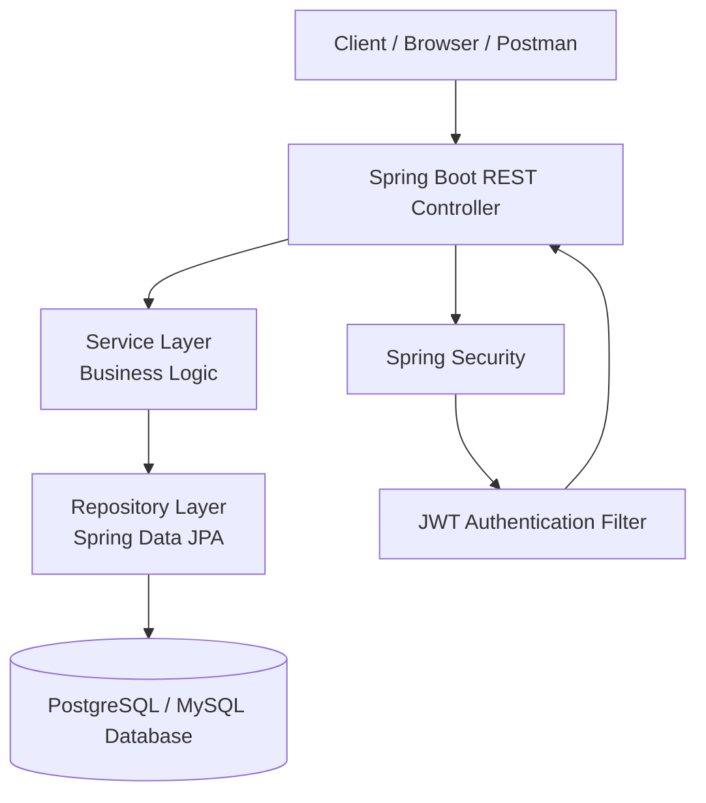
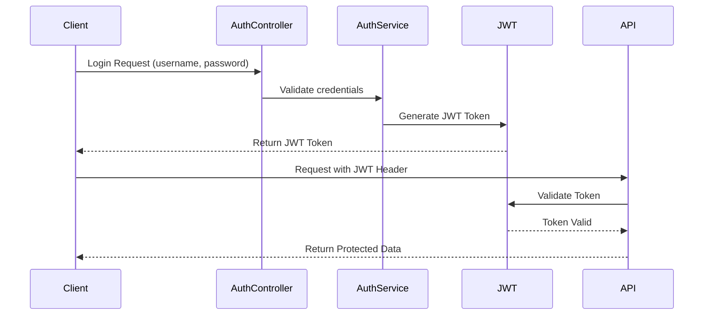
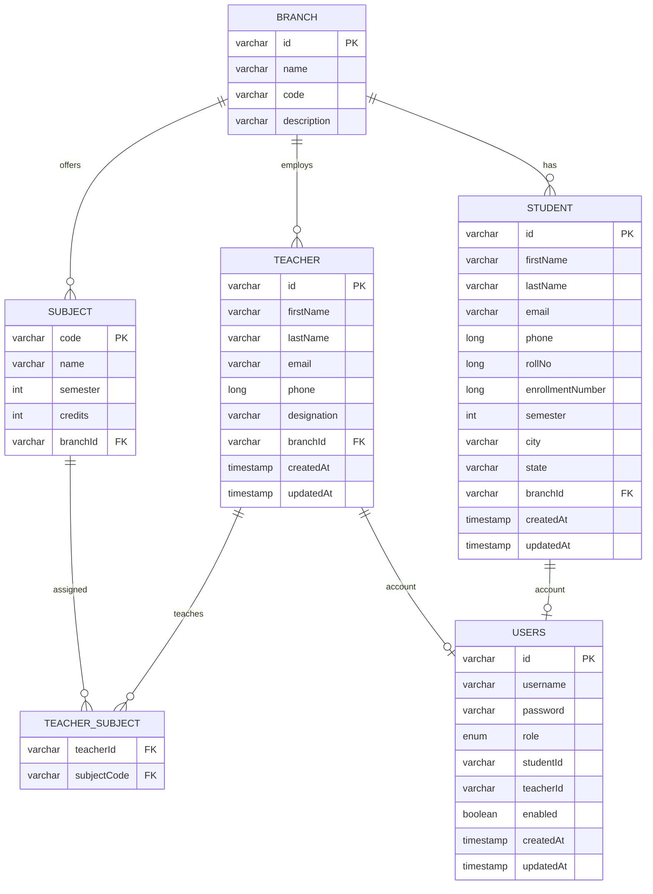
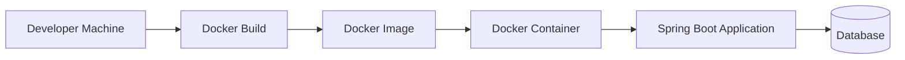

# 🎓 College ERP Backend


A **Spring Boot based RESTful backend system** for managing college operations such as students, teachers, subjects, authentication, and departments.
This project follows **modern backend development practices** including **JWT authentication, layered architecture, and Docker containerization**.

---

# 🚀 Features

✔ Secure **JWT Authentication & Authorization**
✔ **Role Based Access Control** (Admin / Teacher / Student)
✔ **Student Management System**
✔ **Teacher Management System**
✔ **Subject & Department Management**
✔ Clean **RESTful API design**
✔ **Dockerized backend deployment**
✔ **Swagger API Documentation**
✔ **Layered Architecture (Controller → Service → Repository)**

---

# 🛠 Tech Stack

### Backend

* **Java 17**
* **Spring Boot**
* **Spring Security**
* **JWT Authentication**
* **Spring Data JPA**
* **Hibernate**

### Database

* PostgreSQL / MySQL

### Tools

* Docker
* Git
* GitHub
* Maven
* IntelliJ IDEA
* Postman

---

# 🏗 System Architecture

The backend follows a **layered architecture** for clean separation of concerns.



# 🔐 JWT Authentication Flow




---

# 📂 Project Structure

```
college-erp-backend
│
├── src
│   ├── main
│   │   ├── java
│   │   │   └── com.college.erp
│   │   │        ├── controller
│   │   │        ├── service
│   │   │        ├── repository
│   │   │        ├── entity
│   │   │        ├── dto
│   │   │        └── config
│   │   │
│   │   └── resources
│   │        ├── application.properties
│   │        └── static
│
├── Dockerfile
├── pom.xml
├── mvnw
├── mvnw.cmd
└── README.md
# 🗄️ Database ER Diagram

The following diagram represents the **database structure of the College ERP Backend System**, including students, teachers, subjects, branches, and authentication users.




# 🐳 Docker Deployment Architecture




---

# ⚙ Installation & Setup

### 1️⃣ Clone the repository

```
git clone https://github.com/yourusername/college-erp-backend.git
```

### 2️⃣ Navigate to project

```
cd college-erp-backend
```

### 3️⃣ Run the application

Using Maven wrapper:

```
./mvnw spring-boot:run
```

Or using Maven:

```
mvn spring-boot:run
```

Application will start on:

```
http://localhost:8080
```

---

# 🐳 Run with Docker

### Build Docker image

```
docker build -t college-erp-backend .
```

### Run Docker container

```
docker run -p 8080:8080 college-erp-backend
```

Now access the API at:

```
http://localhost:8080
```

---

# 🔑 Authentication

This project uses **JWT (JSON Web Token)** based authentication.

### Login Flow

1. User logs in with credentials
2. Server generates a **JWT token**
3. Client sends token in request headers

Example:

```
Authorization: Bearer <your-token>
```

---

# 📡 Example API Endpoints

| Method | Endpoint        | Description       |
| ------ | --------------- | ----------------- |
| POST   | /api/auth/login | Authenticate user |
| GET    | /api/students   | Get all students  |
| POST   | /api/students   | Create student    |
| GET    | /api/teachers   | Get all teachers  |
| POST   | /api/subjects   | Add subject       |

---

# 📑 API Documentation (Swagger)

This project uses **Swagger OpenAPI** for interactive API documentation.

After running the project open:

```
http://localhost:8080/swagger-ui.html
```

or

```
http://localhost:8080/swagger-ui/index.html
```

Swagger allows you to:

• Explore all available APIs
• Test endpoints directly from the browser
• View request and response schemas

---

# 🔐 Security

Security is implemented using **Spring Security and JWT authentication**.

Features:

* Stateless authentication
* Secure API endpoints
* Role based authorization
* Token based request validation

---

# 🧪 Testing APIs

You can test the APIs using:

* **Postman**
* **Swagger UI**
* **cURL**

Example:

```
curl -X GET http://localhost:8080/api/students
```

---

# 📌 Future Improvements

* Refresh token authentication
* Email verification
* Role management dashboard
* Microservice architecture
* Frontend integration (React / Angular)

---

# 🤝 Contributing

Contributions are welcome.

1. Fork the repository
2. Create a new branch
3. Commit your changes
4. Submit a Pull Request

---

# 👨‍💻 Author

**Ronit Kumar Verma**

B.Tech Computer Science
Backend Developer (Java | Spring Boot | Docker)

GitHub:
https://github.com/ronitverma28

---

# ⭐ Support

If you like this project, please give it a **⭐ on GitHub**.
